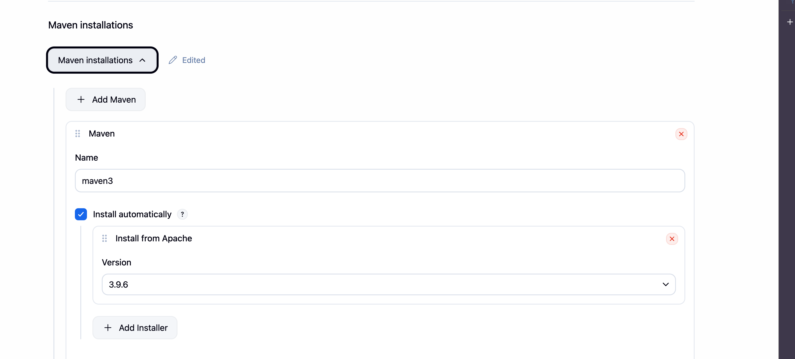
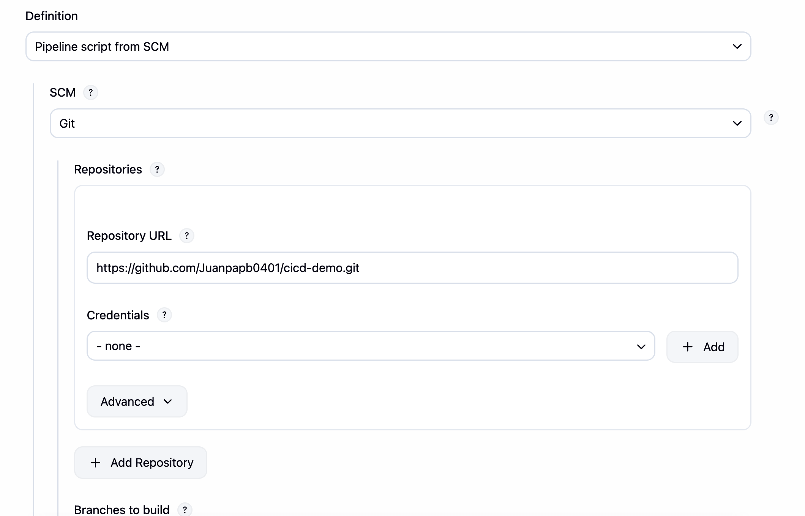
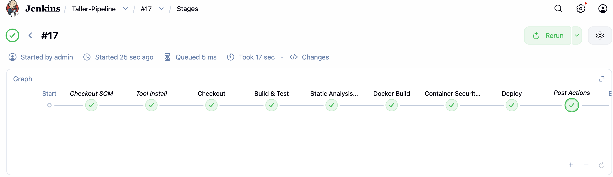
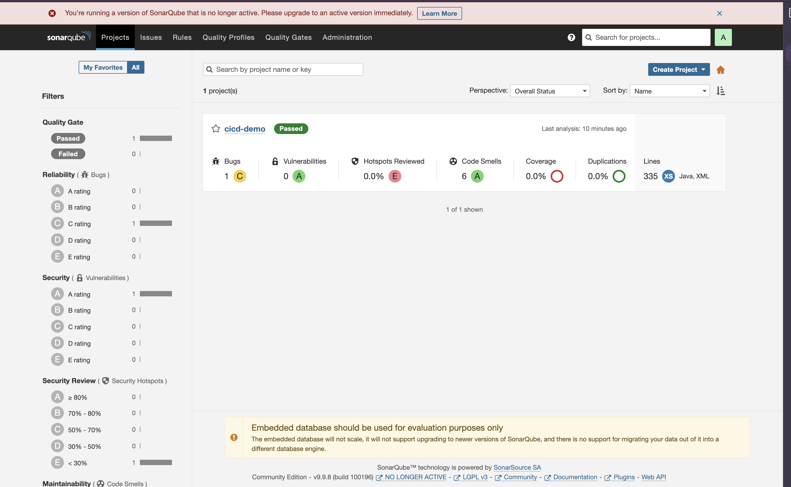
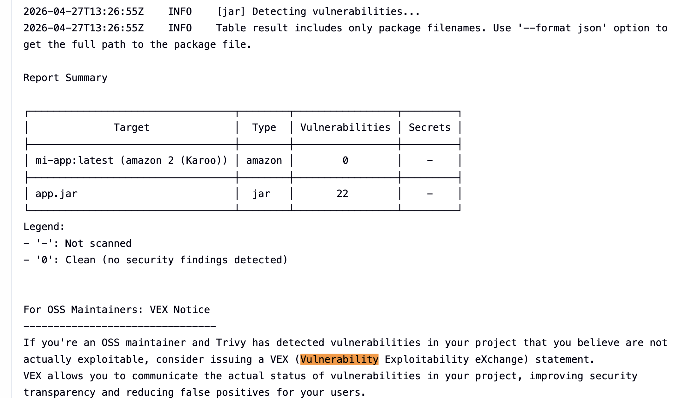
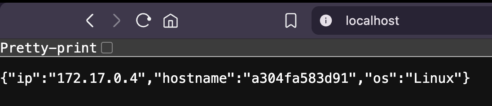

# Taller de Diseño y Construcción de Pipelines CI/CD

Este repositorio contiene la configuración y el flujo de trabajo para la automatización del ciclo de vida de una aplicación Java utilizando Jenkins, SonarQube, Trivy y Docker.

## Infraestructura y Requisitos
La solución se ha desplegado utilizando contenedores Docker en un entorno macOS (Apple Silicon), enfrentando y resolviendo retos de arquitectura ARM64 y comunicación entre contenedores.

* Jenkins: Servidor de automatización principal.
* SonarQube: Plataforma de inspección continua de calidad de código.
* Trivy: Escáner de seguridad para imágenes de contenedores.
* Docker-outside-Docker: Conexión del socket de la máquina host (/var/run/docker.sock) al contenedor de Jenkins para permitir la construcción de imágenes.

---

## 1. Configuración de Herramientas

### Jenkins & Herramientas Globales
Se configuró un Pipeline declarativo integrando Maven 3 para la gestión de dependencias y construcción del proyecto.

### Integración SCM
El pipeline se configuró bajo la modalidad Pipeline script from SCM, asegurando que cualquier cambio en el repositorio de GitHub dispare automáticamente el proceso.

---

## 2. Flujo del Pipeline (Jenkinsfile)

El archivo Jenkinsfile define las siguientes etapas críticas:

1. Checkout: Clonación del código fuente.
2. Build & Test: Compilación mediante Maven (saltando tests de UI para estabilidad del entorno).
3. Static Analysis: Análisis de calidad enviando métricas a SonarQube vía host.docker.internal.
4. Docker Build: Creación de la imagen de producción basada en amazoncorretto:17.
5. Security Scan: Escaneo de vulnerabilidades críticas con Trivy.
6. Deploy: Despliegue automatizado en el puerto 80 local.

---

## 3. Seguridad y Calidad (DevSecOps)

### Análisis Estático con SonarQube
Se integró un token de seguridad para la autenticación del análisis. El reporte permite identificar deuda técnica y fallos de seguridad antes del despliegue.

### Gatekeeping con Trivy
Se implementó una "Puerta de Calidad" que analiza la imagen Docker. El pipeline está configurado para detectar vulnerabilidades CRITICAL.

*Nota: Se documentó la capacidad del pipeline de fallar automáticamente ante riesgos de seguridad (Exit Code 1), validando la integridad del flujo.*

---

## 4. Despliegue y Validación Final

Una vez superadas las validaciones, la aplicación se despliega automáticamente. Se ha verificado el acceso a través del puerto 80 del localhost.

### Limpieza de Infraestructura
Se utiliza el bloque post { always { cleanWs() } } para asegurar que el espacio de trabajo se mantenga limpio y no sature el almacenamiento del servidor.

---

### Notas Técnicas de Implementación
* Se utilizó la dirección host.docker.internal para resolver la comunicación entre el contenedor de Jenkins y el de SonarQube en macOS.
* La imagen base del Dockerfile se actualizó a amazoncorretto:17 para garantizar compatibilidad nativa con procesadores ARM64 (M1/M2/M3).
* Se otorgaron permisos 666 al socket de Docker para permitir la ejecución de comandos docker build desde el usuario jenkins.
